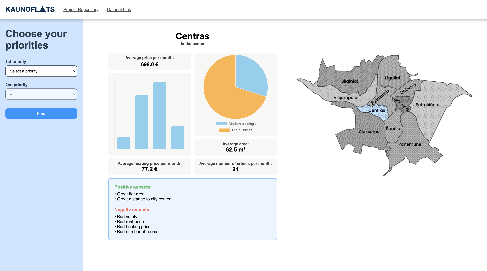
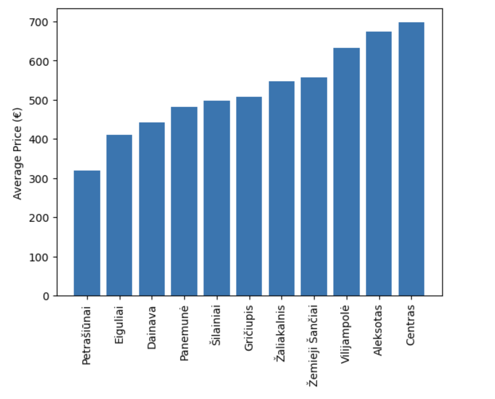
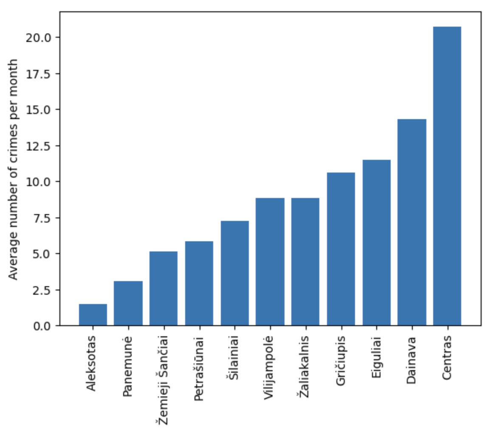
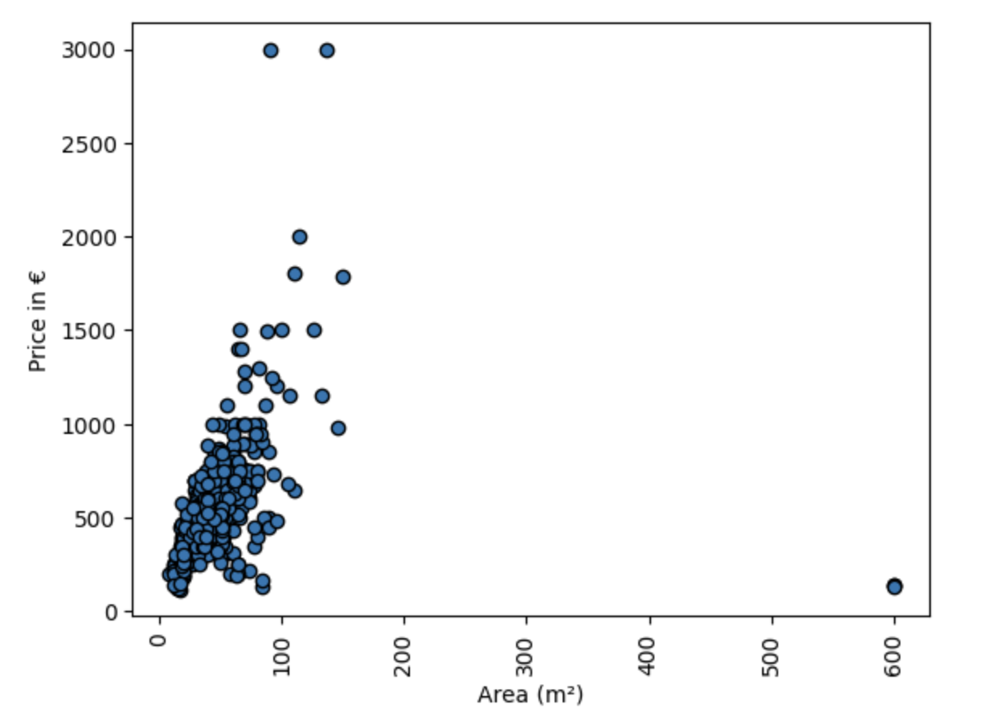
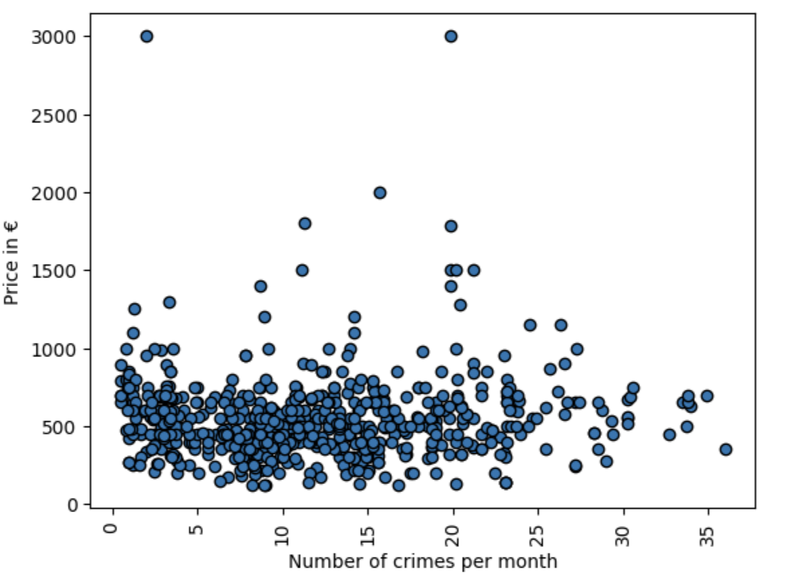

# KAUNOFLATS

**Kauno Flats** is a data-driven Flask web dashboard that helps users find the best district to live in Kaunas, Lithuania. It was built as a complete project pipeline - starting from data collection with a custom scraper, through cleaning and analysis, and finally developing a web app to make insights easily accessible.


> Dashboard design 
---

## Project Workflow

### 1. Data Collection (Web Scraper) [link to repository](https://github.com/gr1dsan/WebsScraper-for-Aurodas.git) 
- A **custom web scraper** was developed to gather housing listings from a Lithuanian real-estate website.  
- The scraper extracted key information such as:  
  - Rent price  
  - Location (district)  
  - Flat size (m²)  
  - Number of rooms  
  - Heating type / costs  
  - Building type (modern / old)  
- This produced a **raw dataset** which will be cleaned in next step.

---

### 2. Data Cleaning & Insights Finding
- The raw dataset was often **inconsistent and noisy** (missing values, irregular formats, etc.).  
- Using **pandas**, I:  
  - Removed duplicates and incomplete records.  
  - Normalized prices, sizes, and heating values into consistent units.  
  - Standardized district names.  
  - Converted categorical values into usable formats.  
- The result was a **clean dataset** ready for analysis [link to dataset](https://kaggle.com/datasets/892818a3efd222a9a2e0260b4eedadb73e8b4d535c7d95d75c5790a758ce46f1), for development dasboard was used another dataset build from this one.
---

### 3. Data Analysis & Exploration
- I performed exploratory analysis in **Jupyter Notebooks** using **pandas** and **matplotlib**.  
- This step allowed me to:  
  - Calculate **average rent prices** per district.
  

  - Find **heating cost differences**.  
  - Compare **modern vs. old buildings amount**.  
  - Calculate **crime rate data** to measure safety.  
  

  - Evaluate **average flat sizes and number of rooms**.
  - Find out if **bigger price is getting you begger area**.
  

  - Understand if **expensive disctricts are safer**.
  
  
- Visualizations (bar charts, pie charts, distributions) helped understand housing patterns in Kaunas.

---

### 4. Building the Web Application
- Based on the cleaned and analyzed dataset, I built a **Flask web app** to make the insights interactive.  
- Key parts of the app:  
  - **Priority Selection** – users choose what matters most (e.g., low price, safety, or proximity to city center).  
  - **Optimal District Recommendation** – the app suggests the best district according to those priorities.  
  - **Interactive Dashboard** with:  
    - Average rent, heating, area, crime rate.  
    - Bar and pie charts (powered by **Chart.js**).  
    - Pros and cons list for each district.  
    - A map of Kaunas with the chosen district highlighted.  

---

## Technologies Used

- **Scraper**: Python (Playwright, BeautifulSoup). 
- **Data Cleaning & Analysis**: Pandas, Matplotlib, Jupyter Notebook.  
- **Dashboard**: Flask (Python backend), HTML, CSS, JavaScript.  

---
## **Installation & Usage**

1. **Clone the repository**:
```bash
git clone https://github.com/gr1dsan/KaunoFlats_Data_Analisys_Project.git
```

2. **Enter the repo folder**:
```bash
cd KaunoFlats_Data_Analisys_Project
```

3. **Set up your virtual enviroment**:

For Mac/Linux:
```bash
python3 venv env
source env/bin/activate
```

For Windows:
```bash
python -m venv env
.\env\Scripts\activate
```

4. **Install all dependencies**:
```bash
pip install -r requirements.txt
```

5. **Run the program**:
```bash
python app.py
```

